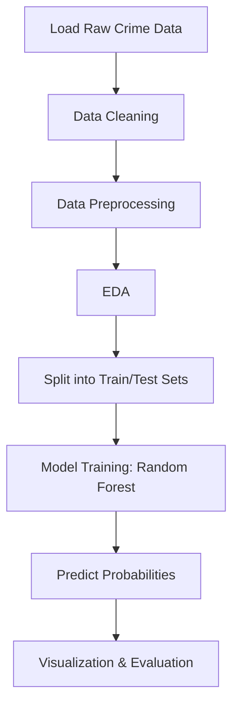

# 🕵️ Crime Pattern Analysis and Predictive Modeling for Urban Safety

This project focuses on analyzing real-world crime data from Los Angeles and applying predictive modeling to identify high-risk crime zones and patterns. Using machine learning (Random Forest Classifier), data cleaning, and geospatial visualization, the goal is to assist urban law enforcement with insights for proactive crime prevention.

---

## 📊 Dataset

Source: [Crime Data from 2020 to Present](https://catalog.data.gov/dataset/crime-data-from-2020-to-present)

| Category      | Description                                                              |
| ------------- | ------------------------------------------------------------------------ |
| Records       | Crime reports from LAPD (Los Angeles Police Department)                  |
| Time Period   | 2020 to Present                                                          |
| Key Features  | Date, Time, Location, Area, Weapon, Crime Type, Victim Demographics      |
| Total Columns | 25+ fields including categorical, numerical, and location-based features |

---

## 🧹 Data Processing Pipeline

---

## 🔍 Exploratory Data Analysis (EDA)

### Victim Age Distribution

- Highest crime victim count in **Adults** (>60,000)
- Followed by **Infants/Toddlers**, then **Seniors**

### Crime by Ethnicity

- Top 3 victim groups: **Hispanic > Black > Other**
- Over 50,000 cases for Hispanic victims

### Geographic Crime Heat

- **Central** area is the highest crime zone (~14k cases)
- Followed by **Southwest**, **Pacific**, and **North Hollywood**

---

## 🤖 Model: Random Forest Classifier

- Input: Cleaned and transformed dataset
- Output: Crime prediction probabilities by category and region
- Evaluation: Accuracy, probability calibration, visualization

### Notable Insights:

- **Violent crimes** against **females** peak in **77th Street division**
- **Sex crimes** against **males** are highest in **Foothill**
- **Central** sees overall high male victimization rates

---

## 🔮 Future Enhancements

- Add real-time data integration (API-based)
- Include external factors: weather, events, socioeconomic data
- Deploy as a web-based crime risk dashboard
- Use geospatial clustering to detect micro-hotspots

---

## 📁 Files Included

| File Name                    | Description                                     |
| ---------------------------- | ----------------------------------------------- |
| `us_crime_data_final.ipynb`  | Jupyter Notebook with entire workflow           |
| `Crime Pattern Analysis.pdf` | Report presentation on findings and methodology |
| `LAPD-Dataset-Link.pdf`      | Data schema and field definitions               |

---

## 📽️ Video Demo

👉 [Watch the Project Video](https://drive.google.com/file/d/1krTlKUT7MfVdPLC-cSG4TxqXvX300dCm/view?usp=sharing)

**Built for urban safety, backed by data.**
